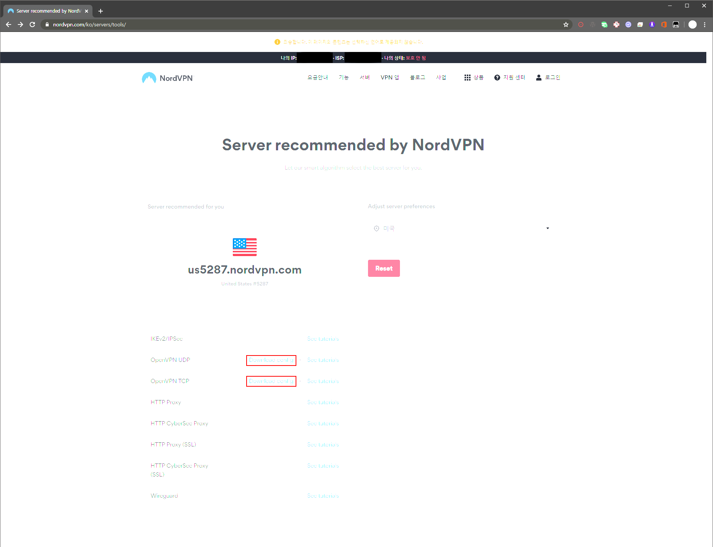
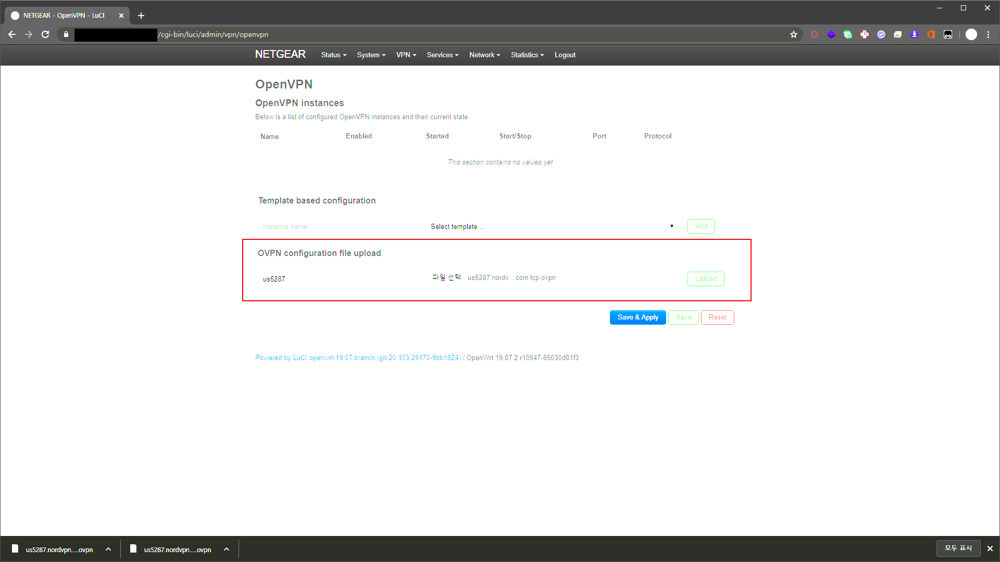
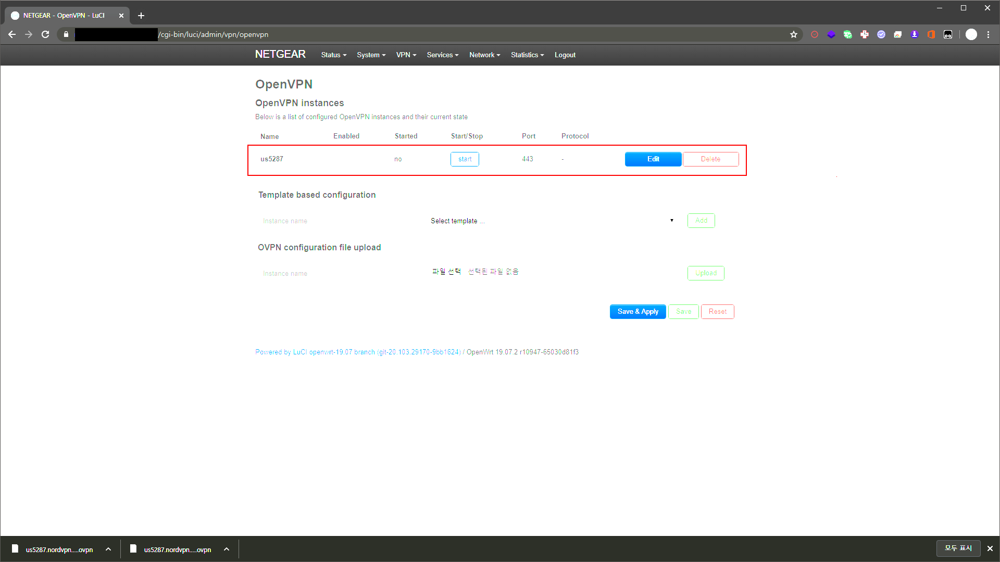
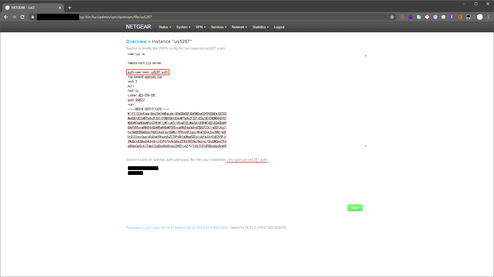
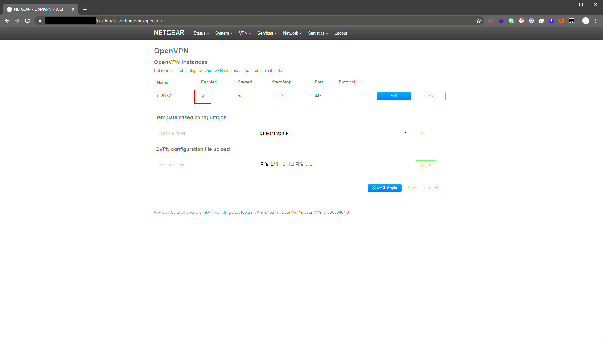
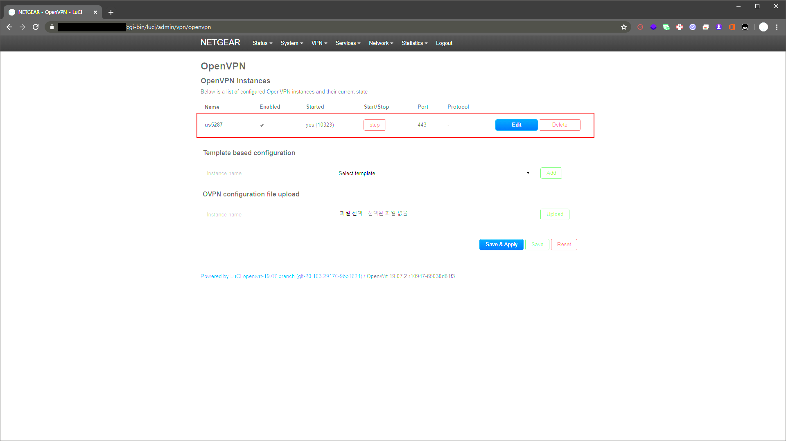
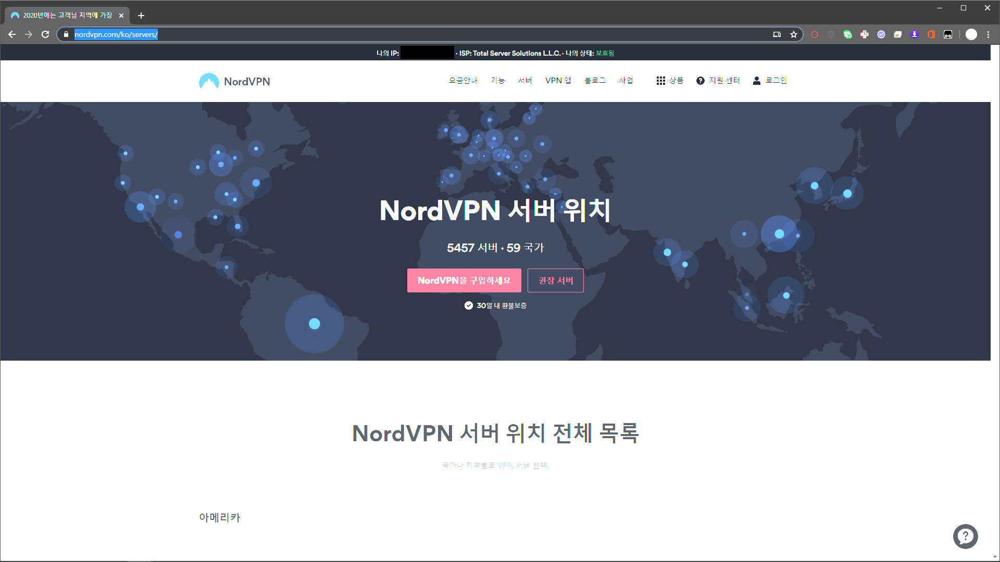

# OpenWRT-with-NordVPN

VPN 을 PC 에 설치 보다는 Route 에 설치 해서 사용하자

[OpenWRT CI setup with NordVPN](https://support.nordvpn.com/Connectivity/Router/1047411192/OpenWRT-CI-setup-with-NordVPN.htm) 참조해서 진행하다 안된것이 있어서 별도의 문서로 만들어봄

## 목차

1. 환경
1. 설치
1. 설정
1. 테스트

## 1. 환경

- OpenWrt 19.07.2 r10947-65030d81f3
- LuCI 를 통한 웹콘솔 접속 SSH 접속
- NordVPN 계정 (유료)

## 2. 설치

OpenWRT 에 3개의 모듈을 설치 합니다.  
SSH 이용해서 설치 또는 LuCI 이용한 웹설치도 가능  

```bash
opkg update
opkg install openvpn-openssl
opkg install ip-full
opkg install luci-app-openvpn
```

## 3. 설정

NordVPN 접속을 원하는 국가의 openvpn 설정 파일을 받기

### 3.1 국가 선택


[VPN 서버](https://nordvpn.com/ko/servers/tools) 이동 하여 접속을 원하는 국가로 선택 하여서 __Show available protocols__ 클릭 하면 상세 정보 출력 한다.  
서버는 __us5287__ 랜덤 하게 발생 TCP (UDP 로도 가능) 설정 파일을 받아 준다.

### 3.2 OpenVPN 설정 파일 업로드


LuCI 로 접속 해서 상단 메뉴>VPN>OpenVPN 으로 이동 한다.
__Instance name__ 에는 us5287 입력 해준다.  
__OVPN config file upload__ 에 __파일 선택__ 으로 다운로드 받은 파일을 선택 후 Upload 한다.

### 3.3 OpenVPN 설정 파일 변경


OpenVPN instances 에서 us5287 의 __EDIT__ 선택


위쪽 text 영역 (us5287.ovpn) 기존 auth-user-pass 만 있는 문자열에 us5287.auth 추가  
openvpn 로그 보고 싶으면 log-append openvpn.log 추가

```txt
auth-user-pass us5287.auth
log-append openvpn.log
```

아래쪽 text 영역 (us5287.auth) NordVPN 계정정보를 입력 첫번째 줄은 메일주소(아이디)  
두번째 줄은 비밀번호

```txt
NordVPN-id
NordVPN-password
```

### 3.4 Network Interface 추가

#### 3.4.1 uci 이용한 방법

```bash
uci set network.nordvpntun=interface
uci set network.nordvpntun.proto='none'
uci set network.nordvpntun.ifname='tun0'
uci commit network
```

#### 3.4.2 설정 파일 직접 수정

vi /etc/config/network

```bash
config interface 'nordvpntun'
        option proto 'none'
        option ifname 'tun0'
```

### 3.5 Firewall 추가

#### 3.5.1 uci 이용한 방법

```bash
uci add firewall zone
uci set firewall.@zone[-1].name='vpnfirewall'
uci set firewall.@zone[-1].input='REJECT'
uci set firewall.@zone[-1].output='ACCEPT'
uci set firewall.@zone[-1].forward='REJECT'
uci set firewall.@zone[-1].masq='1'
uci set firewall.@zone[-1].mtu_fix='1'
uci add_list firewall.@zone[-1].network='nordvpntun'
uci add firewall forwarding
uci set firewall.@forwarding[-1].src='lan'
uci set firewall.@forwarding[-1].dest='vpnfirewall'
uci commit firewall
```

#### 3.5.2 설정 파일 직접 수정

vi /etc/config/firewall

```bash
config zone
        option name 'vpnfirewall'
        option input 'REJECT'
        option output 'ACCEPT'
        option forward 'REJECT'
        option masq '1'
        option mtu_fix '1'
        list network 'nordvpntun'
config forwarding
        option src 'lan'
        option dest 'vpnfirewall'
```

### 3.6 서비스 또는 OpenWRT 재시작

#### 3.6.1 서비스 재시작

firewall, openvpn, netwrok 설정을 변경을 하였으니 3개 서비스 재시작 필요함
__network 를 재시작 하면 SSH 연결 이 분리됨__

```bash
/etc/init.d/firewall restart
/etc/init.d/openvpn restart
/etc/init.d/network restart
```

#### 3.6.2 OpenWRT 재시작

이것 저것 하기 귀찬으면 시스템 재시작
LuCI 로 접속 해서 상단 메뉴>System>Reboot
__Perform reboot__

## 4. 테스트

### 4.1 OpenVPN 동작 확인


us5287 Enabled check 하고 __Save & Apply__


Enabled checked 상태에서 만 실행이 가능

### 4.2 NordVPN 접속 확인


[NordVPN 홈페이지](https://nordvpn.com/ko/servers) 접속을 해서 상단 녹색 문자열로 보호됨
